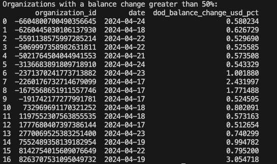

# README

Make sure to setup a new python environment and install the packages through the `requirements.txt` file in the root of the repo.

## Postgresql database

Very crude and simple setup just to be able to run dbt and store the provided data.

__Instructions:__

After installing PostgreSQL and ensuring that it is running, create a database by running:
```
psql postgres -f ./scripts/postgresql/create_db.sql
```
And a test_user and schemas with:
```
psql deel_db -f ./scripts/postgresql/create_db_user_schema.sql
```

This `test_user` will also be used by the python scripts and dbt project for the sake of simplicity.

## Load raw data with python

1. Make sure that `invoices.csv` and `organizations.csv` are in `./raw_data` (for simplicity the paths are hardcoded in the python script).
2. Run `python3 ./scripts/python/load_data.py` from the root of the project. It should take a couple of minutes (~15 minutes) to load everything into the Postgres database.
3. Once the script finished you should have the tables `raw_invoices` and `raw_organizations` in the `raw` schema of the `deel_db` database.
    * You can confirm this by running: `SELECT * FROM pg_catalog.pg_tables where schemaname='raw'` while connected to the `deel_db` database.

## dbt project

To build all the dbt related artifacts you can run `dbt build` in `./deel_dbt_project`.
This will run all the models in the mart, staging and qa layers; they map as follows to the `deel_db` database:
```
{
    ./staging: deel_db.public_staging,
    ./mart: deel_db.public_mart, 
    ./qa: deel_db.public_qa
}
```

You should be able to see the new tables along with the `raw` ones by running this query:
````
SELECT * FROM pg_catalog.pg_tables where tableowner='test_user';
````

__Brief explanation on the structure__

1. `staging` contains the staging models that take the raw data and cast it to the proper data types.
2. `mart` contains the dimension and fact tables requested in the challenge.
3. `qa` contains a support view for the alerting task.

When you run `dbt build` you should get an output similar to this one:


## Alert function

Again to keep this simple I decided to skip Airflow and just wrote a very simple function in Python that prints to the console its output.

You can run this from the root of the repo using `python3 ./scripts/python/alert.py`. 
There are 2 optional input arguments: 
* `lookback_days` - the number of days to lookback in the data (constrained by the data available through the `dod_account_balance` view).
* `threshold` - if the user wants to change the threshold from 0.5 to another value.

Using bother arguments would look something like `python3 ./scripts/python/alert.py --lookback_days 2 --threshold 0.1`

Here's an example output with the default values:

